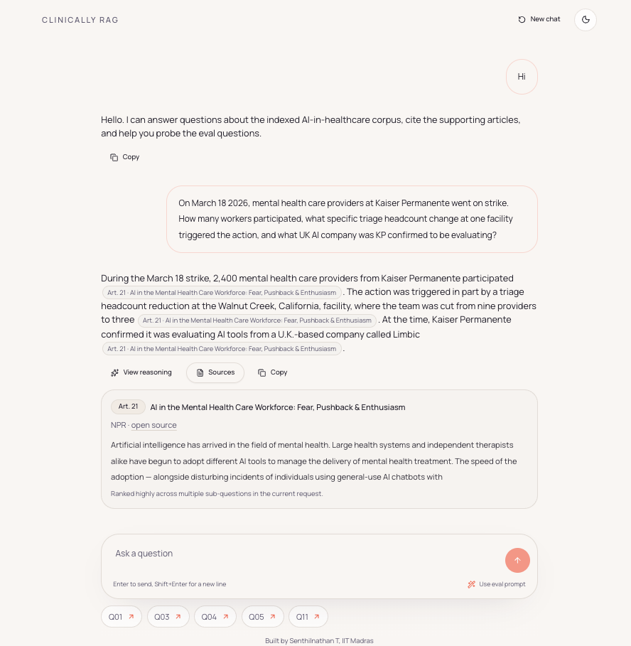

# Clinically Rag

Clinically Rag is a minimal, chat-first healthcare AI research app built for the Together Fund take-home. It ingests the provided 21-article corpus, routes each query through a real LangGraph workflow, retrieves chunk-level evidence with hybrid search, streams answers into a calm chat UI, and lets reviewers inspect reasoning and sources only when they want to.

Live app: [clinically-rag.vercel.app](https://clinically-rag.vercel.app/)



The product runs in assignment-first mode:

- greetings and product-help turns are answered directly
- healthcare AI answers must be grounded in the indexed corpus
- unsupported or unrelated questions are refused instead of answered from model memory

## Product shape

- Empty state: almost empty screen, centered composer, subtle example prompts
- Chat state: single conversation column, sticky bottom composer, tiny left-aligned streaming status beneath the latest user message
- Assistant turns: inline citations, mutually exclusive `View reasoning` / unique `Sources` reveals, `Copy`
- No dashboard panels, no permanent source inspector, no marketing homepage

## Architecture

- Frontend: Next.js App Router, TypeScript, Tailwind, `next-themes`
- Backend: custom SSE chat route, lightweight intent pre-router, LangGraph JS/TS orchestration, Vertex AI Gemini model calls
- Retrieval: Vertex AI Gemini embeddings + Pinecone dense search + local BM25-style sparse scoring
- Data: PDF-derived corpus/eval metadata, local chunk manifest, live Article 21 ingest

LangGraph nodes:

1. `router`
2. `decomposer`
3. `retriever`
4. `evidenceAssembler`
5. `synthesizer`
6. `critic`
7. `formatter`

Routing:

- `simple_factual`: `router -> retriever`
- `multi_hop | live | follow_up`: `router -> decomposer -> retriever`

## Canonical artifact

The graph, API, and UI all share one assistant artifact:

- `intent`
- `answerMarkdown`
- `routeTaken`
- `citationAnchors[]`
- `reasoningTrace`
- `criticSummary`
- `sourceDetails[]`

Key behavior:

- direct greeting/help/out-of-scope replies skip retrieval and citations
- corpus-grounded replies preserve citations, reasoning trace, and source details
- citation anchors are mapped to exact answer spans
- source details preserve chunk-level evidence metadata
- follow-up context is passed explicitly in each request
- critic degradation never erases the answer

## Ingestion and retrieval

- The provided PDFs are normalized into structured JSON under `data/generated`
- The ingest script fetches all 21 article URLs, extracts content, chunks text, stores metadata, and optionally upserts to Pinecone
- Article 21 is mandatory live content and is explicitly checked in the ingest manifest and smoke script
- Retrieval merges dense Pinecone scores with sparse BM25-style scores, query-specific coverage, and metadata-based article boosts
- Manual override notes currently supplement articles 9, 10, 11, and 12 when direct extraction does not expose enough evaluation-critical detail

## Local run

```bash
npm install
npm run prepare:data
cp .env.example .env.local
npm run ingest
npm run dev
```

Optional checks:

```bash
npm run smoke
npm run typecheck
npm run build
npm run eval
```

## Environment variables

Required auth:

- `GOOGLE_API_KEY`, or
- `GOOGLE_CLOUD_PROJECT` with ADC/service account credentials

When both auth paths are present, the app prefers `GOOGLE_API_KEY` and ignores the project/location path for Vertex client initialization.

Required model config:

- `GEMINI_MODEL`
- `GEMINI_TOOLS_MODEL`
- `GEMINI_EMBEDDING_MODEL`
- `PINECONE_API_KEY`
- `PINECONE_INDEX_NAME`
- `PINECONE_NAMESPACE`

Usually required:

- `GOOGLE_CLOUD_LOCATION`
- `PINECONE_HOST`
- `NEXT_PUBLIC_APP_URL`

See [SETUP.md](./SETUP.md) and [DEPLOY_VERCEL.md](./DEPLOY_VERCEL.md) for exact steps.

## Validation status

- Implemented: yes
- Syntax-checked: yes, `npm run typecheck`
- Locally validated: yes, `npm run build` and `npm run smoke`
- Fully run and verified: partially; the live eval run depends on outbound Vertex AI access and available quota
